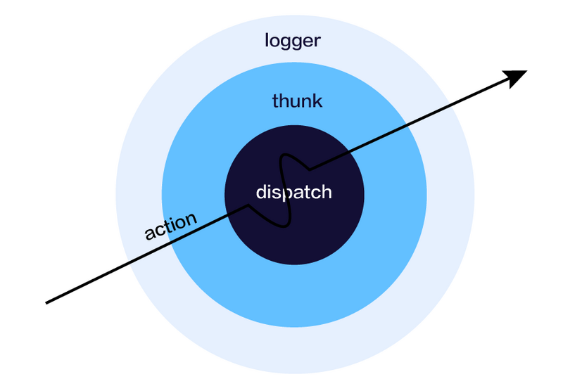

# 3.3  理解 Redux 中间件




关于 redux 中间件的原理，为后面理解 redux 异步 action 做铺垫，主要内容为：

- Redux 中间件是什么
- 使用 Redux 中间件
- logger 中间件结构分析
- applyMiddleware 
- 中间件的执行过程

## 3.3.1 Redux 中间件是什么

> Redux moddleware provides a third-party extension point between dispatching an action, and the moment it reaches the reducer.  

redux 提供了类似后端 Express 的中间件概念，本质的目的是提供第三方插件的模式，自定义拦截
`action -> reducer` 的过程。变为 `action -> middlewares -> reducer` 。这种机制可以让我们改变数据流，实现如异步 action ，action 过滤，日志输出，异常报告等功能。

## 3.3.2 使用 Redux 中间件

Redux 提供了一个叫 `applyMiddleware` 的方法，可以应用多个中间件，以日志输出中间件为例

```js
import { createStore, applyMiddleware } from 'redux'
import createLogger from 'redux-logger'
import rootReducer from './reducers'

const loggerMiddleware = createLogger()
const initialState = {}

return createStore(
    rootReducer,
    initialState,
    applyMiddleware(
      loggerMiddleware
    )
  )
```

## 3.3.3 logger 中间件结构分析

看看 redux-logger 的源码结构

```js
function createLogger(options = {}) {
  /**
   * 传入 applyMiddleWare 的函数
   * @param  {Function} { getState      }) [description]
   * @return {[type]}      [description]
   */
  return ({ getState }) => (next) => (action) => {
    let returnedValue;
    const logEntry = {};
    logEntry.prevState = stateTransformer(getState());
    logEntry.action = action;
    // .... 
    returnedValue = next(action);
    // ....
    logEntry.nextState = stateTransformer(getState());
    // ....
    return returnedValue;
  };
}

export default createLogger;
```

Logger 中这样的结构 `({ getState }) => (next) => (action) => {}` 看起来是很奇怪的，这种设计如果没有 es6 的箭头函数，扩展下来就是 

```js
/**
 * getState 可以返回最新的应用 store 数据
 */
function ({getState}) {
    /**
     * next 表示执行后续的中间件，中间件有可能有多个
     */
    return function (next) {
        /**
         * 中间件处理函数，参数为当前执行的 action 
         */
        return function (action) {...}
    }
}
```

这样的结构本质上就是为了将 middleware 串联起来执行，为了分析 middleware 的执行顺序，还得看看 applyMiddleware 的实现

## 3.3.4 applyMiddleware 分析

下面是 applyMiddleware 完整的代码，参数为 middlewares 数组：

```js
import compose from './compose'

/**
 * Creates a store enhancer that applies middleware to the dispatch method
 * of the Redux store. This is handy for a variety of tasks, such as expressing
 * asynchronous actions in a concise manner, or logging every action payload.
 *
 * See `redux-thunk` package as an example of the Redux middleware.
 *
 * Because middleware is potentially asynchronous, this should be the first
 * store enhancer in the composition chain.
 *
 * Note that each middleware will be given the `dispatch` and `getState` functions
 * as named arguments.
 *
 * @param {...Function} middlewares The middleware chain to be applied.
 * @returns {Function} A store enhancer applying the middleware.
 */
export default function applyMiddleware(...middlewares) {
  return (createStore) => (reducer, preloadedState, enhancer) => {
    var store = createStore(reducer, preloadedState, enhancer)
    var dispatch = store.dispatch
    var chain = []

    var middlewareAPI = {
      getState: store.getState,
      dispatch: (action) => dispatch(action)
    }
    chain = middlewares.map(middleware => middleware(middlewareAPI))
    dispatch = compose(...chain)(store.dispatch)

    return {
      ...store,
      dispatch
    }
  }
}
```

1. `applyMiddleware` 执行过后返回一个闭包函数，目的是将创建 `store`的步骤放在这个闭包内执行，这样 `middleware` 就可以共享 `store` 对象。
2. `middlewares` 数组 map 为新的 `middlewares` 数组，包含了 `middlewareAPI`
3. `compose` 方法将新的 `middlewares` 和 `store.dispatch` 结合起来，生成一个新的 `dispatch` 方法
4. 返回的 `store` 新增了一个 `dispatch` 方法， 这个新的 `dispatch` 方法是改装过的 `dispatch`，也就是封装了中间件的执行。

所以关键点来到了 compose 方法了，下面来看一下 compose 的设计：

```js
export default function compose(...funcs) {
  if (funcs.length === 0) {
    return arg => arg
  }

  if (funcs.length === 1) {
    return funcs[0]
  }

  const last = funcs[funcs.length - 1]
  const rest = funcs.slice(0, -1)
  return (...args) => rest.reduceRight((composed, f) => f(composed), last(...args))
}
```

可以看到 compose 方法实际上就是利用了 `Array.prototype.reduceRight` 。如果对 reduceRight 不是很熟悉，来看看下面的一个例子就清晰了：

```js
/**
 * [description]
 * @param  {[type]} previousValue [前一个项]
 * @param  {[type]} currentValue  [当前项]
 */
[0, 1, 2, 3, 4].reduceRight(function(previousValue, currentValue, index, array) {
  return previousValue + currentValue;
}, 10);
```

执行结果：

|  #  |previousValue| currentValue |return value|
|-----|-------------|--------------|------------|
|第一次|  10         |       4      |    14      |
|第二次|  14         |       3      |    17      |
|第三次|  17         |       2      |    19      |
|第四次|  19         |       1      |    20      |
|第五次|  20         |       0      |    20      |


## 3.3.5 理解中间件的执行过程

通过上面的 applyMiddleware 和 中间件的结构，假设应用了如下的中间件: [A, B, C]，一个 action 的完整执行流程

### 初始化阶段 

**一个中间件的结构为**

```js
function ({getState}) {
    return function (next) {
        return function (action) {...}
    }
}
```

**初始化阶段一：middlewares map 为新的 middlewares**

```js
chain = middlewares.map(middleware => middleware(middlewareAPI))
```

执行过后，middleware 变为了

```js
function (next) {
    return function (action) {...}
}
```

**初始化阶段二：compose 新的 dispatch** 

```js
const newDispatch = compose(newMiddlewares)(store.dispatch)
```

dispatch 的实现为 reduceRight, 当一个新的 action 来了过后

```js
/**
 * 1. 初始值为： lastMiddleware(store.dispatch)
 * 2. previousValue: composed
 * 3. currentValue: currentMiddleware
 * 4. return value: currentMiddleware(composed) => newComposed
 */
rest.reduceRight((composed, f) => f(composed), last(...args))
```

### composed 流程

reduceRight 的执行过程：

**初始时候**

1. **initialValue:** composedC = C(store.dispatch) = function C(action) {}
2. **next 闭包：** store.dispatch

**第一次执行：**

0. **previousValue(composed)**: composedC
1. **currentValue(f):** B
2. **return value:** composedBC = B(composedC) = function B(action){} 
3. **next 闭包** composedC

**第二次执行：**

0. **previousValue(composed)**: composedBC 
1. **currentValue(f):** A
2. **return value:** composedABC = A(composedBC) = function A(action){} 
3. **next 闭包** composedBC 


最后的返回结果为 `composedABC`

### 执行阶段 

1. `dispatch(action)` 等于 `composedABC(action)` 等于执行 `function A(action) {...}`
2. 在函数 A 中执行 `next(action)`, 此时 A 中 `next` 为 `composedBC`，那么等于执行 `composedBC(action)` 等于执行 `function B(action){...}`
3. 在函数 B 中执行 `next(action)`, 此时 B 中 `next` 为 `composedC`，那么等于执行 `composedC(action)` 等于执行 `function C(action){...}`
4. 在函数 C 中执行 `next(action)`, 此时 C 中 `next` 为 `store.dispatch` 即 store 原生的 dispatch, 等于执行 `store.dispatch(action)`
5. store.dispatch 会执行 reducer 生成最新的 store 数据 
6. 所有的 next 执行完过后开始回溯
7. 执行函数 C 中 next 后的代码
8. 执行函数 B 中 next 后的代码
9. 执行函数 A 中 next 后的代码 


整个执行 action 的过程为 `A -> B -> C -> dispatch -> C -> B -> A` 


  [1]: /img/bVymhZ